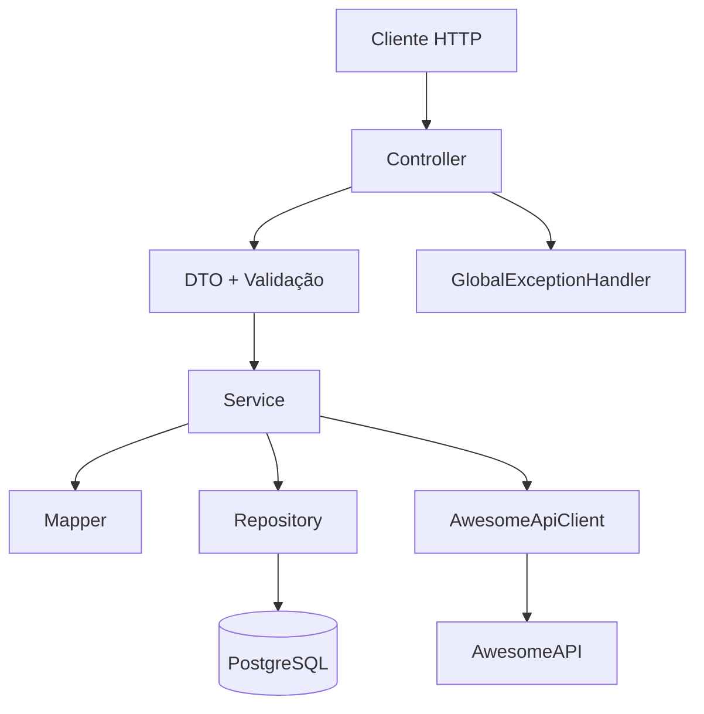
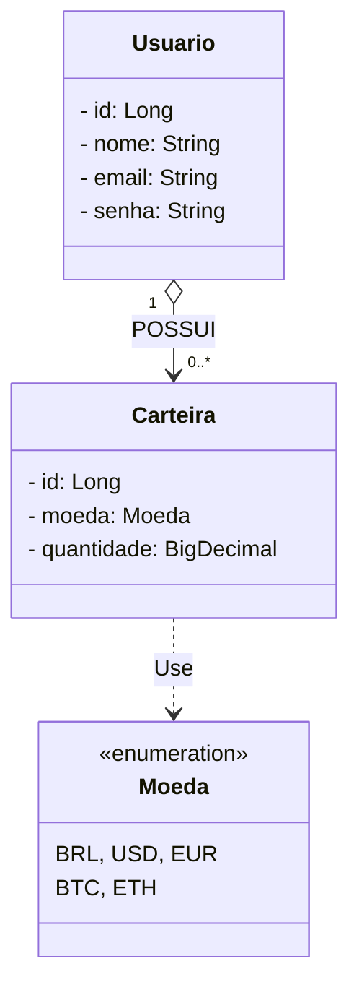

# 🪙 CoinWallet API

> API RESTful desenvolvida com **Java e Spring Boot 4** para gerenciamento de usuários e carteiras de moedas, com cálculo de patrimônio total convertido para reais utilizando cotações da **AwesomeAPI**.
>
> Projeto desenvolvido no módulo de Design Patterns do bootcamp **DIO — Itaú: Java com Inteligência Artificial**, com foco na organização das camadas, integração com serviços externos, documentação da API e boas práticas de desenvolvimento backend.

---

## 📌 Visão Geral do Projeto

A **CoinWallet API** permite cadastrar usuários, gerenciar saldos em diferentes moedas e consultar o patrimônio total convertido para reais (BRL).

### Principais funcionalidades

- **Gestão de usuários:** cadastro, consulta e exclusão de usuários.
- **Gestão de carteiras:** criação de carteiras por moeda e atualização de saldo por acréscimo de quantidade.
- **Consulta de patrimônio:** consulta das carteiras de um usuário e cálculo do patrimônio total em reais.
- **Cotação de moedas:** integração com a AwesomeAPI utilizando Spring Cloud OpenFeign.
- **Persistência de dados:** armazenamento de usuários e carteiras em PostgreSQL com Spring Data JPA.
- **Validação de dados:** validação das requisições com Jakarta Bean Validation.
- **Mapeamento de objetos:** conversão entre DTOs e entidades utilizando MapStruct.
- **Documentação da API:** documentação interativa com Swagger UI e especificação OpenAPI.
- **Testes unitários:** utilização de JUnit e Mockito para testar componentes da aplicação.
- **Tratamento de exceções:** respostas adequadas para usuários não encontrados, conflitos e indisponibilidade de cotações.

---

## 🏛️ Arquitetura do Projeto

O projeto utiliza uma arquitetura em camadas, separando as responsabilidades para facilitar a manutenção, os testes e a compreensão do código.



### Responsabilidades das camadas

* **Controller:** recebe as requisições HTTP e define as respostas.
* **DTO:** define os dados aceitos e retornados pela API.
* **Service:** concentra as regras de negócio e coordena as operações.
* **Mapper:** converte DTOs em entidades e entidades em DTOs utilizando MapStruct.
* **Repository:** abstrai o acesso e a persistência dos dados com Spring Data JPA.
* **Client:** encapsula a comunicação HTTP com a AwesomeAPI por meio do OpenFeign.
* **Exception Handler:** centraliza o tratamento de exceções e converte erros em respostas HTTP.

---

## 🧩 Design Patterns e recursos utilizados

O projeto utiliza padrões arquiteturais e recursos do Spring Framework para organizar o código e reduzir o acoplamento entre os componentes. Nem todo recurso utilizado representa, necessariamente, uma implementação explícita de um padrão GoF.

### -> Adapter Pattern

O Adapter Pattern permite que interfaces incompatíveis trabalhem em conjunto por meio de um componente adaptador.

Na aplicação, o mapeamento de DTOs e a conversão de respostas externas para estruturas internas possuem objetivos relacionados à adaptação de dados. Entretanto, **MapStruct e OpenFeign não caracterizam automaticamente implementações explícitas do Adapter Pattern**.

- **MapStruct:** automatiza a conversão entre DTOs e entidades.
- **OpenFeign:** simplifica a comunicação HTTP com a AwesomeAPI e a desserialização das respostas em objetos Java.

### -> Facade Pattern

O Facade Pattern fornece uma interface simplificada para um conjunto de funcionalidades ou subsistemas.

A camada de serviço oferece um ponto central para executar as regras de negócio e coordenar componentes como repositórios, mapeadores e clientes externos. Essa organização pode desempenhar um papel semelhante ao de uma fachada, dependendo da implementação concreta.

### -> Proxy Pattern

O Proxy Pattern utiliza um objeto intermediário para controlar ou intermediar o acesso a outro objeto.

O Spring utiliza proxies em diferentes funcionalidades da aplicação, como:

- **Spring Data JPA:** implementações geradas para as interfaces de repositório.
- **OpenFeign:** implementação declarativa do cliente HTTP por meio de um objeto gerado pelo framework.
- **`@Transactional`:** pode utilizar proxies para aplicar o gerenciamento transacional aos métodos interceptados.

Esses recursos são gerenciados pelo framework, sem exigir a implementação manual de todas as classes de proxy.

### -> Singleton Pattern

O Singleton Pattern restringe a criação de instâncias de uma classe a uma única instância acessível.

No Spring, os beans utilizam o escopo `singleton` por padrão. Isso significa que o container mantém uma instância compartilhada de cada bean dentro daquele contexto de aplicação, salvo configuração diferente.

### -> Builder Pattern

O Builder Pattern permite construir objetos complexos por meio de etapas de configuração.

A configuração da `SecurityFilterChain` utiliza a API fluente do Spring Security para declarar regras e filtros de segurança. Essa construção pode apresentar características semelhantes ao Builder, mas o uso da DSL, isoladamente, não comprova a implementação explícita do padrão GoF.

### -> DTO — Data Transfer Object

Objetos utilizados para transportar dados entre a API e o cliente, evitando a exposição direta das entidades JPA.

Exemplos: `UsuarioRequest`, `UsuarioResponse`, `CarteiraRequest`, `CarteiraResponse` e `PatrimonioTotalResponse`.

### -> Repository Pattern

Abstrai o acesso aos dados, evitando que as operações de persistência fiquem diretamente nos serviços.

Implementado por interfaces que estendem `JpaRepository`, aproveitando os recursos do Spring Data JPA.

### -> Service Layer

Centraliza as regras de negócio e mantém os controllers enxutos, separando a lógica da aplicação das requisições HTTP.

Exemplos: `UsuarioService` e `CarteiraService`.

### -> Client para integração externa

O `AwesomeApiClient` utiliza Spring Cloud OpenFeign para realizar chamadas HTTP de forma declarativa, isolando a comunicação com a AwesomeAPI do restante da aplicação.

### -> Injeção de dependências

O Spring gerencia os componentes e suas dependências por meio do container IoC.

O Lombok, com `@RequiredArgsConstructor`, reduz o código necessário para a injeção via construtor ao gerar automaticamente um construtor para os atributos `final` e outros atributos obrigatórios.

---

## 🗃️ Modelo de Dados



Um usuário pode possuir várias carteiras, enquanto cada carteira pertence a um usuário e está associada a uma moeda.

A quantidade armazenada representa o saldo daquela moeda. Ao enviar uma nova requisição para uma carteira já existente, a quantidade informada é acrescentada ao saldo atual.

O enum `Moeda` define as moedas disponíveis no projeto. Os valores devem corresponder às moedas efetivamente implementadas.

---

## 🛠️ Stack Tecnológica

| Componente | Tecnologia |
|---|---|
| Linguagem | Java |
| Framework | Spring Boot 4 |
| Persistência | Spring Data JPA / Hibernate |
| Banco de dados | PostgreSQL |
| Integração HTTP | Spring Cloud OpenFeign |
| Mapeamento de objetos | MapStruct |
| Validação | Jakarta Bean Validation |
| Segurança de senha | Spring Security `PasswordEncoder` |
| Utilitários | Lombok |
| Testes unitários | JUnit / Mockito |
| Documentação da API | Springdoc OpenAPI / Swagger UI |
| Especificação da API | OpenAPI JSON |
| Infraestrutura | Docker / Docker Compose |
| Build | Gradle |

---

## 📚 Documentação da API — Swagger/OpenAPI

A aplicação utiliza **Springdoc OpenAPI** para gerar a especificação da API e disponibilizar uma interface interativa para consultar os endpoints e experimentar as requisições HTTP.

### Swagger UI

Com a aplicação em execução, acesse:

[http://localhost:8080/swagger-ui/index.html](http://localhost:8080/swagger-ui/index.html)

### Especificação OpenAPI em JSON

A especificação gerada pela aplicação pode ser consultada em:

[http://localhost:8080/v3/api-docs](http://localhost:8080/v3/api-docs)

### Gerar o arquivo OpenAPI

O projeto utiliza o plugin `org.springdoc.openapi-gradle-plugin` para gerar um arquivo JSON da documentação.

Com a aplicação configurada e as dependências necessárias disponíveis, execute:

```bash
./gradlew generateOpenApiDocs
```

No Windows, utilizando o terminal compatível com o Gradle Wrapper:

```bash
gradlew.bat generateOpenApiDocs
```

Conforme a configuração do `build.gradle`, o arquivo será gerado em:

```text
docs/openapi.json
```

A geração utiliza a URL configurada em `apiDocsUrl`, que aponta para `http://localhost:8080/v3/api-docs`. Portanto, a aplicação precisa estar acessível nessa URL durante a execução da tarefa.

---

## 🚀 Como Executar o Projeto

### Pré-requisitos

- Git.
- Docker Desktop e Docker Compose.
- JDK compatível com a versão Java configurada no projeto.
- Gradle Wrapper, incluído no repositório.

### 1. Clonar o repositório

```bash
git clone https://github.com/LucasNs7/coin-wallet-api.git
cd coin-wallet-api
```

### 2. Configurar o banco de dados

Confira o `docker-compose.yml` e o `application.properties` para verificar o nome do banco, usuário, senha, porta e demais configurações utilizadas.

Caso o projeto utilize variáveis de ambiente, configure os valores exigidos antes de iniciar a aplicação. Se houver um arquivo de exemplo de configuração, utilize-o como referência.

Não publique credenciais reais no repositório.

### 3. Iniciar o PostgreSQL

```bash
docker compose up -d
```

Verifique se o container do banco foi iniciado corretamente antes de executar a aplicação.

### 4. Executar a aplicação

No Linux ou macOS:

```bash
./gradlew bootRun
```

No Windows:

```bash
gradlew.bat bootRun
```

Por padrão, o Spring Boot utiliza a porta `8080`, salvo configuração diferente.

Após a inicialização, a documentação interativa poderá ser acessada em:

[http://localhost:8080/swagger-ui/index.html](http://localhost:8080/swagger-ui/index.html)

---

## 📑 Endpoints da API

As rotas abaixo correspondem aos controllers apresentados no projeto.

### Usuários

| Método   | Endpoint            | Descrição                     |
| -------- | ------------------- | ----------------------------- |
| `POST`   | `/usuarios`         | Cadastra um usuário           |
| `GET`    | `/usuarios/{email}` | Busca um usuário pelo e-mail  |
| `DELETE` | `/usuarios/{email}` | Exclui um usuário pelo e-mail |

### Carteiras

| Método | Endpoint                       | Descrição                                                   |
| ------ | ------------------------------ | ----------------------------------------------------------- |
| `POST` | `/carteiras`                   | Cria uma carteira ou acrescenta saldo à existente           |
| `GET`  | `/carteiras/total-brl/{email}` | Consulta as carteiras e calcula o patrimônio total em reais |

### Observações

- O cadastro de usuário retorna `201 Created`, conforme a implementação descrita.
- As demais operações devem ser consultadas nos controllers para confirmar seus respectivos status HTTP de sucesso.
- As requisições com DTOs validados utilizam `@Valid`.
- O patrimônio depende da disponibilidade das cotações necessárias na AwesomeAPI.
- Os detalhes dos parâmetros, corpos das requisições e respostas podem ser consultados no Swagger UI.

### Resposta do patrimônio total

O DTO `PatrimonioTotalResponse` contém os seguintes campos:

- `usuarioEmail`: e-mail do usuário consultado.
- `carteiras`: lista de carteiras associadas ao usuário.
- `totalEmBrl`: valor total do patrimônio convertido para reais.

O cálculo considera os saldos das carteiras e as cotações necessárias para a conversão, de acordo com as regras de negócio implementadas.

---

## 💡 Decisões de Arquitetura e Boas Práticas

1. **Precisão financeira com `BigDecimal`:** utilizado para representar saldos, cotações e valores convertidos, evitando os problemas de precisão de `float` e `double`.

2. **Separação de responsabilidades:** controllers, serviços, repositórios, DTOs e mappers possuem funções distintas, facilitando a manutenção e os testes.

3. **Mapeamento com MapStruct:** reduz conversões manuais e mantém a transformação de objetos separada das regras de negócio.

4. **Integração com OpenFeign:** encapsula as chamadas à AwesomeAPI em um cliente dedicado.

5. **Proteção de senhas:** o `PasswordEncoder` permite armazenar a senha codificada, sem persistir o valor original em texto puro.

6. **Tratamento de erros:** exceções específicas permitem identificar recursos não encontrados, conflitos e falhas na consulta de cotações.

7. **Transações com Spring:** `@Transactional` define o contexto transacional das operações de serviço.

8. **Escopo simplificado:** O projeto prioriza a gestão de usuários, carteiras e consulta de patrimônio, sem adicionar funcionalidades de histórico ou simulação de conversão que não estejam implementadas nos endpoints atuais.

9. **Segurança:** A aplicação não exige autenticação nem autorização por usuário ou perfil. Os endpoints estão publicamente acessíveis, e a proteção CSRF está desabilitada.

10. **Config de Segurança:** Essa configuração foi adotada para simplificar o escopo do projeto, garantindo criptografia de senha, e não é recomendada para uma aplicação financeira em produção.

11. **Testes unitários:** JUnit e Mockito permitem verificar regras de negócio e simular dependências, como repositórios e clientes externos, reduzindo a necessidade de acessar serviços reais durante esses testes.

12. **Documentação OpenAPI:** o Springdoc OpenAPI gera uma especificação padronizada da API e disponibiliza o Swagger UI para facilitar a exploração dos endpoints e a realização de testes manuais.

---

## 🎯 Objetivo do Projeto

Aplicar os conceitos de desenvolvimento backend com Java e Spring Boot, demonstrando a utilização de padrões de projeto, padrões arquiteturais e recursos do framework que favorecem a organização do código, a separação de responsabilidades, os testes e a integração com serviços externos.

O foco está em construir uma API simples, funcional e bem estruturada, com documentação acessível e adequada ao desafio proposto no bootcamp.

---

<div align="center">

**Lucas**  
*Desenvolvedor Java Backend*

[LinkedIn](https://www.linkedin.com/in/lucas-ns7/) | [GitHub](https://github.com/LucasNs7)

---

*Projeto de Design Patterns desenvolvido como parte do Bootcamp da DIO: **Itaú - Java com Inteligência Artificial**.*


</div>
