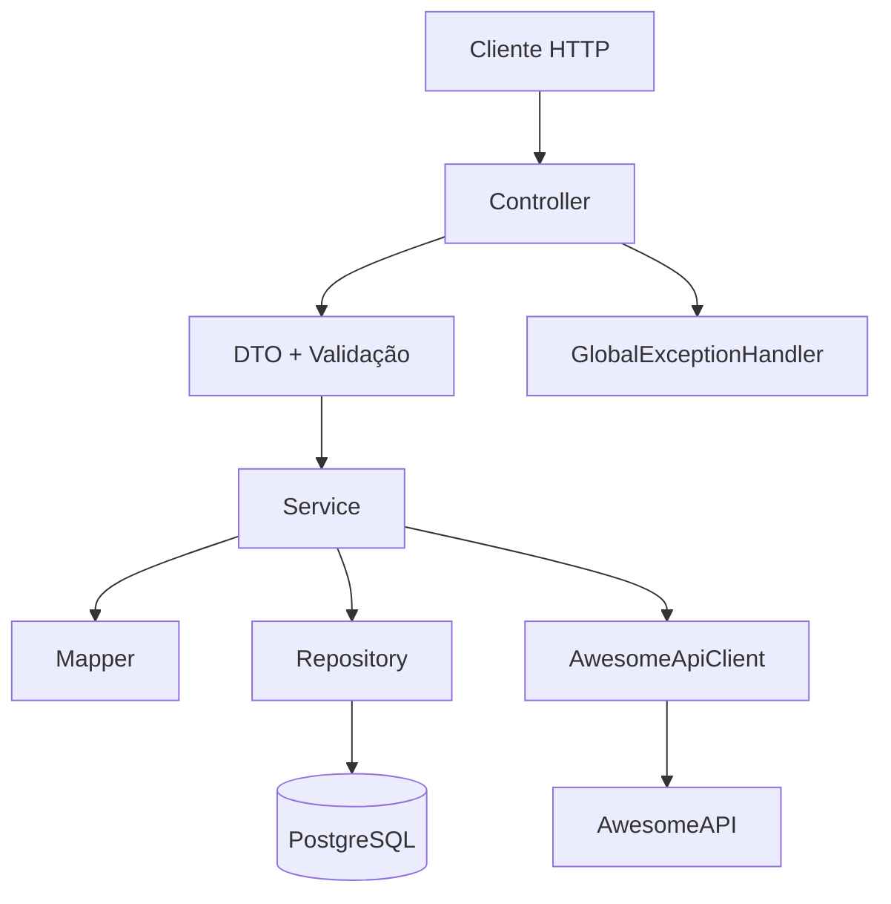
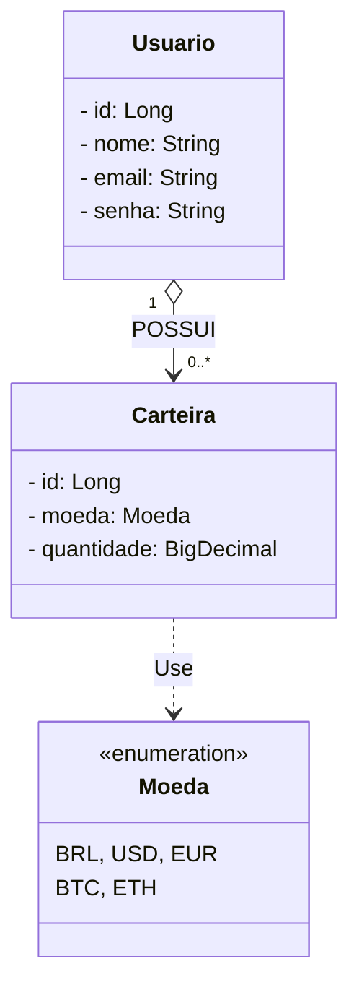

# 🪙 CoinWallet API

> API RESTful desenvolvida com **Java e Spring Boot 4** para gerenciamento de usuários e carteiras de moedas, com cálculo de patrimônio total convertido para reais utilizando cotações da **AwesomeAPI**.
>
> Projeto desenvolvido no módulo de Design Patterns do bootcamp **DIO — Itaú: Java com Inteligência Artificial**, com foco na organização das camadas, integração com serviços externos e boas práticas de desenvolvimento backend.

---

## 📌 Visão Geral do Projeto

A **CoinWallet API** permite cadastrar usuários, gerenciar saldos em diferentes moedas e consultar o patrimônio total convertido para reais (BRL).

### Principais funcionalidades

* **Gestão de usuários:** cadastro, consulta e exclusão de usuários.
* **Gestão de carteiras:** criação de carteiras por moeda e atualização de saldo por acréscimo de quantidade.
* **Consulta de patrimônio:** cálculo do valor total das carteiras em reais.
* **Cotação em tempo real:** integração com a AwesomeAPI utilizando Spring Cloud OpenFeign.
* **Persistência de dados:** armazenamento de usuários e carteiras em PostgreSQL com Spring Data JPA.
* **Validação de dados:** validação das requisições com Jakarta Bean Validation.
* **Tratamento de exceções:** respostas adequadas para usuários não encontrados, conflitos e indisponibilidade de cotações.

---

## 🏛️ Arquitetura do Projeto

O projeto utiliza uma arquitetura em camadas, separando as responsabilidades para facilitar a manutenção e a compreensão do código.



### Responsabilidades das camadas

* **Controller:** recebe as requisições HTTP e define as respostas.
* **DTO:** define os dados aceitos e retornados pela API.
* **Service:** concentra as regras de negócio e coordena as operações.
* **Mapper:** converte DTOs em entidades e entidades em DTOs utilizando MapStruct.
* **Repository:** abstrai o acesso e a persistência dos dados com Spring Data JPA.
* **Client:** encapsula a comunicação HTTP com a AwesomeAPI por meio do OpenFeign.
* **Exception Handler:** centraliza o tratamento de exceções e converte erros em respostas HTTP.

---

## 🧩 Design Patterns e recursos utilizados

### -> Adapter Pattern

Utilizado pelo MapStruct - Para adaptar DTOs em Entidades e vice-versa.

Utilizado pelo OpenFeign - Para adaptar a resposta JSON da AwesomeAPI em DTOs internos.

### -> Facade Pattern

Camadas de Service e Controller, simplificando o acesso a regras de negócio e integrações complexas.

### -> Proxy Pattern

Empregado pelo Spring Data JPA (@Repository), OpenFeign (@FeignClient) e gerenciamento transacional (@Transactional).

### -> Singleton Pattern

Gerenciamento dos Beans da aplicação via Container IoC do Spring Framework.

### -> Builder Pattern

Construção da cadeia de filtros de segurança (SecurityFilterChain).

### -> DTO — Data Transfer Object

Objetos utilizados para transportar dados entre a API e o cliente sem expor diretamente as entidades JPA.

Exemplos: `UsuarioRequest`, `UsuarioResponse`, `CarteiraRequest` e `PatrimonioTotalResponse`.

### -> Repository Pattern

Abstrai o acesso ao banco de dados, evitando que as consultas SQL ou operações de persistência fiquem diretamente nos serviços.

Implementado com interfaces que estendem `JpaRepository`.

### -> Service Layer

Centraliza as regras de negócio, mantendo os controllers enxutos e separando a lógica da aplicação das requisições HTTP.

Exemplos: `UsuarioService` e `CarteiraService`.

### -> Client para integração externa

O `AwesomeApiClient` utiliza Spring Cloud OpenFeign para realizar chamadas HTTP de forma declarativa, isolando a comunicação com a API externa do restante da aplicação.

### -> Injeção de dependências

O Spring gerencia os componentes e suas dependências. O Lombok, por meio de `@RequiredArgsConstructor`, reduz o código necessário para a injeção via construtor.

---

## 🗃️ Modelo de Dados



Um usuário pode possuir várias carteiras, enquanto cada carteira pertence a um usuário e está associada a uma moeda.

A quantidade armazenada representa o saldo daquela moeda. Ao enviar uma nova requisição para uma carteira já existente, a quantidade informada é acrescentada ao saldo atual.

O enum `Moeda` define as moedas disponíveis no projeto. Os valores devem corresponder às moedas efetivamente implementadas.

---

## 🛠️ Stack Tecnológica

| Componente            | Tecnologia                                   |
| --------------------- | -------------------------------------------- |
| Linguagem             | Java                                         |
| Framework             | Spring Boot 4                                |
| Persistência          | Spring Data JPA / Hibernate                  |
| Banco de dados        | PostgreSQL                                   |
| Integração HTTP       | Spring Cloud OpenFeign                       |
| Mapeamento de objetos | MapStruct                                    |
| Validação             | Jakarta Bean Validation                      |
| Segurança de senha    | Spring Security PasswordEncoder              |
| Utilitários           | Lombok                                       |
| Infraestrutura        | Docker / Docker Compose                      |
| Build                 | Gradle                                       |
| Documentação da API   | Readme.md |

---

## 🚀 Como Executar o Projeto

### Pré-requisitos

* Git
* Docker Desktop e Docker Compose
* JDK compatível com a versão Java configurada no projeto
* Gradle Wrapper, incluído no repositório

### 1. Clonar o repositório

```bash
git clone https://github.com/LucasNs7/coin-wallet-api.git
cd coin-wallet-api
```

### 2. Configurar o banco de dados

Confira o `docker-compose.yml` e o `application.properties` para verificar o nome do banco, usuário, senha e porta utilizados.

Se o projeto estiver configurado para utilizar variáveis de ambiente, crie um arquivo `.env` com os nomes definidos no Compose.

### 3. Iniciar o PostgreSQL

```bash
docker compose up -d
```

### 4. Executar a aplicação

No Linux ou macOS:

```bash
./gradlew bootRun
```

No Windows:

```bash
gradlew.bat bootRun
```

Por padrão, o Spring Boot utiliza a porta `8080`, salvo configuração diferente.

---

## 📑 Endpoints da API

As rotas abaixo correspondem aos controllers apresentados no projeto.

### Usuários

| Método   | Endpoint            | Descrição                     |
| -------- | ------------------- | ----------------------------- |
| `POST`   | `/usuarios`         | Cadastra um usuário           |
| `GET`    | `/usuarios/{email}` | Busca um usuário pelo e-mail  |
| `DELETE` | `/usuarios/{email}` | Exclui um usuário pelo e-mail |

### Carteiras

| Método | Endpoint                       | Descrição                                                   |
| ------ | ------------------------------ | ----------------------------------------------------------- |
| `POST` | `/carteiras`                   | Cria uma carteira ou acrescenta saldo à existente           |
| `GET`  | `/carteiras/total-brl/{email}` | Consulta as carteiras e calcula o patrimônio total em reais |

**Observações:**

* O cadastro de usuário retorna `201 Created`.
* As demais operações apresentadas retornam `200 OK` em caso de sucesso.
* As requisições com DTOs validados utilizam `@Valid`.
* O patrimônio depende da disponibilidade das cotações necessárias na AwesomeAPI.

---

## 💡 Decisões de Arquitetura e Boas Práticas

1. **Precisão financeira com `BigDecimal`:** utilizado para representar saldos, cotações e valores convertidos, evitando os problemas de precisão de `float` e `double`.

2. **Separação de responsabilidades:** controllers, serviços, repositórios, DTOs e mappers possuem funções distintas, facilitando a manutenção e os testes.

3. **Mapeamento com MapStruct:** reduz conversões manuais e mantém a transformação de objetos separada das regras de negócio.

4. **Integração com OpenFeign:** encapsula as chamadas à AwesomeAPI em um cliente dedicado.

5. **Proteção de senhas:** o `PasswordEncoder` permite armazenar a senha codificada, sem persistir o valor original em texto puro.

6. **Tratamento de erros:** exceções específicas permitem identificar recursos não encontrados, conflitos e falhas na consulta de cotações.

7. **Transações com Spring:** `@Transactional` define o contexto transacional das operações de serviço.

8. **Escopo simplificado:** O projeto prioriza a gestão de usuários, carteiras e consulta de patrimônio, sem adicionar funcionalidades de histórico ou simulação de conversão que não estejam implementadas nos endpoints atuais.

9. **Segurança:** Devido ao escopo simples do projeto as configs de segurança não estão desenvolvidas, optei apenas por criptrografia de senha. Os endpoints estão a livre acesso, sem autenticação de usuários e roles.

---

## 🎯 Objetivo do Projeto

Aplicar os conceitos de desenvolvimento backend com Java e Spring Boot, demonstrando a utilização de padrões e recursos que favorecem a organização do código, a separação de responsabilidades e a integração com serviços externos.

O foco está em construir uma API simples, funcional e bem estruturada, adequada ao desafio proposto no bootcamp.

---

<div align="center">

**Lucas**  
*Desenvolvedor Java Backend*

[LinkedIn](https://www.linkedin.com/in/lucas-ns7/) | [GitHub](https://github.com/LucasNs7)

---

*Projeto desenvolvido no módulo de Design Patterns como parte do Bootcamp da DIO: Itaú - Java com Inteligência Artificial.*


</div>
